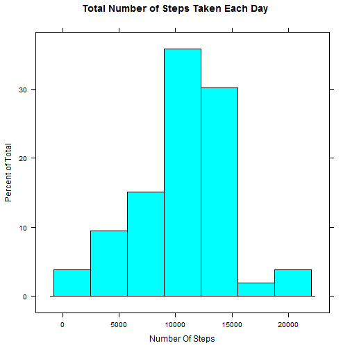
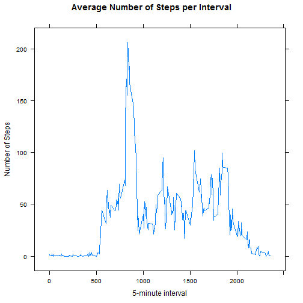
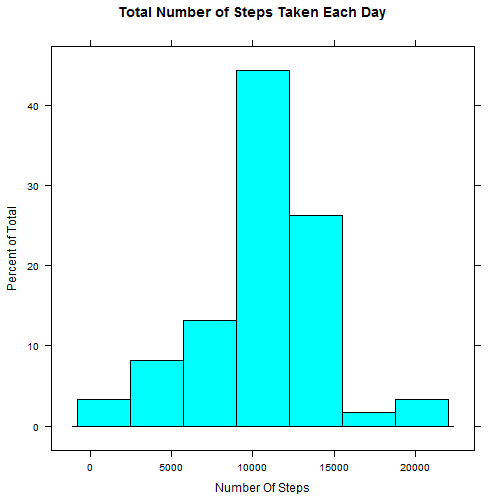
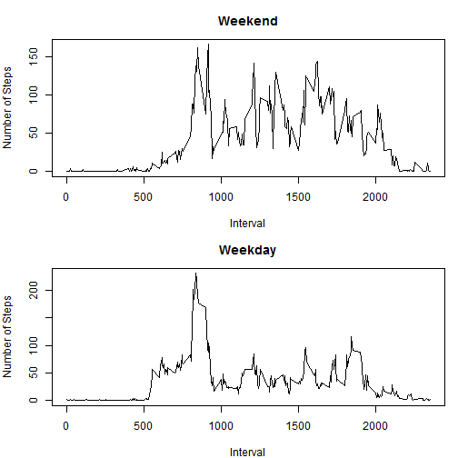

## 1. Loading and preprocessing the data

After forking the repository RepData_PeerAssessment1 and cloning it to my computer, 
I have set a working directory to be RepData_PeerAssessment1 and 
am proceeding in the next step with unzipping and loading the data set into R.


```r
unzip('activity.zip', exdir = 'activity')
activ <- read.csv('activity/activity.csv') 
str(activ)
```

```
## 'data.frame':	17568 obs. of  3 variables:
##  $ steps   : int  NA NA NA NA NA NA NA NA NA NA ...
##  $ date    : Factor w/ 61 levels "2012-10-01","2012-10-02",..: 1 1 1 1 1 1 1 1 1 1 ...
##  $ interval: int  0 5 10 15 20 25 30 35 40 45 ...
```

Since the column 'date' is a factor variable, I'm going to change it to 'date' type:

```r
activ$date <- as.Date(activ$date)
```

I am also checking the total number of days/unique dates, those with all missing values included

```r
library(dplyr)
n_distinct(activ$date)
```

```
## [1] 61
```

## 2. What is mean total number of steps taken per day?

Since for this part of the assignment, I can ignore the missing values in the dataset,
I use aggregate function whose default is to ignore missing values in the given variables.

Calculating the total number of steps taken per day:

```r
numSteps <- aggregate(steps ~ date, data = activ, sum)
head(numSteps)
```

```
##         date steps
## 1 2012-10-02   126
## 2 2012-10-03 11352
## 3 2012-10-04 12116
## 4 2012-10-05 13294
## 5 2012-10-06 15420
## 6 2012-10-07 11015
```

Making a histogram of the total number of steps taken each day:

```r
library(lattice)
histogram( ~ steps, data = numSteps, xlab = 'Number Of Steps', main = 'Total Number of Steps Taken Each Day')
```

 

Calculating and reporting the mean and median of the total number of steps taken per day:

```r
summary(numSteps$steps)
```

```
##    Min. 1st Qu.  Median    Mean 3rd Qu.    Max. 
##      41    8841   10760   10770   13290   21190
```

I'm including another way of calculating mean and median because I get slightly different values using this method:

```r
mean(numSteps$steps)
```

```
## [1] 10766.19
```

```r
median(numSteps$steps)
```

```
## [1] 10765
```

## 3. What is the average daily activity pattern?

Make a time series plot (i.e. type = "l") of the 5-minute interval (x-axis) and the average number of steps taken, averaged across all days (y-axis).

```r
avgSteps <- aggregate(steps ~ interval, data  = activ, mean)
head(avgSteps)
```

```
##   interval     steps
## 1        0 1.7169811
## 2        5 0.3396226
## 3       10 0.1320755
## 4       15 0.1509434
## 5       20 0.0754717
## 6       25 2.0943396
```

```r
xyplot(steps ~ interval, data = avgSteps, type = 'l', xlab = '5-minute interval', ylab = 'Number of Steps', main = 'Average Number of Steps per Interval')
```

 

Which 5-minute interval, on average across all the days in the dataset, 
contains the maximum number of steps?

```r
which(avgSteps$steps == max(avgSteps$steps))
```

```
## [1] 104
```

```r
avgSteps$interval[104]
```

```
## [1] 835
```

## 4. Imputing missing values

Calculating and reporting the total number of missing values in the dataset 
(i.e. the total number of rows with NAs)

```r
sum(is.na(activ$steps))
```

```
## [1] 2304
```

```r
sum(is.na(activ$date))
```

```
## [1] 0
```

```r
sum(is.na(activ$interval))
```

```
## [1] 0
```
*All the missing values are in the column/variable 'steps' and there are 2304 missing values.*

Devise a strategy for filling in all of the missing values in the dataset.
The strategy does not need to be sophisticated. 
For example, you could use the mean/median for that day, or the mean for that 5-minute interval, etc.

*I am using the mean for the 5-minute interval to fill in all of the missing values.*

```r
names(avgSteps)[2] <- 'avg_steps'
data <- merge(activ, avgSteps, by = 'interval')
data$steps[is.na(data$steps)] <- data$avg_steps[is.na(data$steps)]
```

Creating a new dataset that is equal to the original dataset but with the missing data filled in

```r
activity <- select(data, -avg_steps )
```

Making a histogram of the total number of steps taken each day:

```r
tot_steps <- aggregate(steps ~ date, data = activity, sum)
histogram( ~ steps, data = tot_steps, xlab = 'Number Of Steps', main = 'Total Number of Steps Taken Each Day')
```

 

Calculate and report the mean and median total number of steps taken per day. 
Do these values differ from the estimates from the first part of the assignment?

```r
mean(tot_steps$steps)
```

```
## [1] 10766.19
```

```r
median(tot_steps$steps)
```

```
## [1] 10766.19
```
*The numbers for mean and median do not differ from the estimates from the first part of the assignment.*

What is the impact of imputing missing data on the estimates of the total daily number of steps?

```r
summary(numSteps)
```

```
##       date                steps      
##  Min.   :2012-10-02   Min.   :   41  
##  1st Qu.:2012-10-16   1st Qu.: 8841  
##  Median :2012-10-29   Median :10765  
##  Mean   :2012-10-30   Mean   :10766  
##  3rd Qu.:2012-11-16   3rd Qu.:13294  
##  Max.   :2012-11-29   Max.   :21194
```

```r
summary(tot_steps)
```

```
##       date                steps      
##  Min.   :2012-10-01   Min.   :   41  
##  1st Qu.:2012-10-16   1st Qu.: 9819  
##  Median :2012-10-31   Median :10766  
##  Mean   :2012-10-31   Mean   :10766  
##  3rd Qu.:2012-11-15   3rd Qu.:12811  
##  Max.   :2012-11-30   Max.   :21194
```
*From the summaries of both data sets we cannot see any major changes in mean or median value,* 
*but some changes are noticable on 1st and 3rd quartile values.*

```r
str(numSteps)
```

```
## 'data.frame':	53 obs. of  2 variables:
##  $ date : Date, format: "2012-10-02" "2012-10-03" ...
##  $ steps: int  126 11352 12116 13294 15420 11015 12811 9900 10304 17382 ...
```

```r
str(tot_steps)
```

```
## 'data.frame':	61 obs. of  2 variables:
##  $ date : Date, format: "2012-10-01" "2012-10-02" ...
##  $ steps: num  10766 126 11352 12116 13294 ...
```
*Inspecting both data sets we also notice that we have whole days of missing values for a 'step' variable.*
*Imputing missing values gave us + 8 days in which the total number of steps is actually the mean of the* *total number of steps taken per day.*

```r
sd(numSteps$steps)
```

```
## [1] 4269.18
```

```r
sd(tot_steps$steps)
```

```
## [1] 3974.391
```
*As we can see from the standard deviations of the total number of steps per day,*
*replacing missing values with mean values results in an underestimation of the standard deviation.*

## Are there differences in activity patterns between weekdays and weekends?


```r
activity$days <- weekdays(activity$date)
head(activity)
```

```
##   interval    steps       date       days
## 1        0 1.716981 2012-10-01     Montag
## 2        0 0.000000 2012-11-23    Freitag
## 3        0 0.000000 2012-10-28    Sonntag
## 4        0 0.000000 2012-11-06   Dienstag
## 5        0 0.000000 2012-11-24    Samstag
## 6        0 0.000000 2012-11-15 Donnerstag
```
*Note: The names of weekdays are in German.*

Create a new factor variable in the dataset with two levels - "weekday" and "weekend" 
indicating whether a given date is a weekday or weekend day.

```r
activity$day_week <- grepl('^S', activity$days)
activity$day[activity$day_week] <- 'weekend'
activity$day[!activity$day_week] <- 'weekday'
activity <- select(activity, -day_week)
head(activity)
```

```
##   interval    steps       date       days     day
## 1        0 1.716981 2012-10-01     Montag weekday
## 2        0 0.000000 2012-11-23    Freitag weekday
## 3        0 0.000000 2012-10-28    Sonntag weekend
## 4        0 0.000000 2012-11-06   Dienstag weekday
## 5        0 0.000000 2012-11-24    Samstag weekend
## 6        0 0.000000 2012-11-15 Donnerstag weekday
```

Make a panel plot containing a time series plot (i.e. type = "l") of the 5-minute interval (x-axis)
and the average number of steps taken, averaged across all weekday days or weekend days (y-axis).

```r
weekdayAvg <- aggregate(steps ~ interval, data = activity, subset = activity$day == 'weekday', FUN = mean)
weekendAvg <- aggregate(steps ~ interval, data = activity, subset = activity$day  == 'weekend', FUN = mean)
names(weekdayAvg)[2] <- 'weekday_avg_steps'
names(weekendAvg)[2] <- 'weekend_avg_steps'
weekAct <- merge(weekdayAvg, weekendAvg, by = 'interval')
head(weekAct)
```

```
##   interval weekday_avg_steps weekend_avg_steps
## 1        0        2.25115304       0.214622642
## 2        5        0.44528302       0.042452830
## 3       10        0.17316562       0.016509434
## 4       15        0.19790356       0.018867925
## 5       20        0.09895178       0.009433962
## 6       25        1.59035639       3.511792453
```

```r
par(mfrow = c(2,1), mar = c(4, 4, 3, 1))
with(weekAct, plot(interval, weekend_avg_steps, type = 'l', xlab = 'Interval', ylab = 'Number of Steps', main = 'Weekend'))
with(weekAct, plot(interval, weekday_avg_steps, type = 'l', xlab = 'Interval', ylab = 'Number of Steps', main = 'Weekday'))
```

 
*Here I used base plotting system.*


